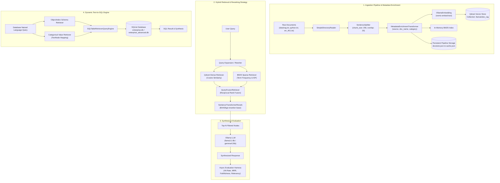

# Enterprise RAG & LLM Orchestration Framework with LlamaIndex

[](https://www.python.org/)
[](https://www.llamaindex.ai/)
[](https://qdrant.tech/)
[-purple.svg)](https://ollama.ai/)

---

## 1️⃣ Project Overview

`learn-llamaindex` is an enterprise-grade Retrieval-Augmented Generation (RAG) and LLM orchestration framework built with **LlamaIndex**, **Qdrant**, and **Ollama**. It addresses context hallucination, low recall on exact terms, and query-domain mismatch by implementing production RAG architectures—such as **Hybrid Dense-Sparse Search**, **Reciprocal Rank Fusion (RRF)**, **Cross-Encoder Reranking**, **Hierarchical Auto-Merging Retrieval**, **Semantic Router Engines**, and **Categorical Value-Aware Text-to-SQL**.

The repository serves both as a complete technical blueprint and a modular toolkit for building, evaluating, and deploying private, high-precision RAG applications locally.

---

## 2️⃣ Features

- ⚙️ **Persistent Ingestion & Deduplication Pipeline**: Production ingestion pipeline with sentence splitting (256-token chunk size, 20-token overlap), automated metadata enrichment (`category`, `document_name`, `source`), persistent `docstore.json` and `cache.json`, and upsert deduplication.
- 🔀 **Hybrid Dense + Sparse BM25 Retrieval**: Combines semantic dense vector embeddings (`nomic-embed-text` in Qdrant) with an in-memory BM25 probabilistic sparse keyword retriever for exact match accuracy (e.g., error codes like `ERR-401`).
- ⚡ **Reciprocal Rank Fusion (RRF) & Cross-Encoder Reranking**: Fuses sparse and dense retrieval rank lists using RRF alongside multi-query generation (`QueryRewriter`), re-scoring top candidates with `BAAI/bge-reranker-base`.
- 🌲 **Hierarchical Auto-Merging Retrieval**: Multi-tier document parsing (`512 -> 256 -> 128` token hierarchy) linking child leaf nodes to parent context, dynamically merging child chunks when similarity cutoffs are satisfied.
- 🧭 **Recursive Pointer Retrieval**: Multi-domain routing using `IndexNode` pointer references to steer queries to specialized vector sub-indexes (e.g., RAG specifications vs. Python code documentation).
- 🛣️ **Semantic Router Engines & Tools**: LLM-driven query routers that evaluate incoming prompts and dynamically select between dedicated query engines or retriever tools based on intent.
- 📊 **Dynamic Text-to-SQL with Value Retrieval**:
  - **Schema Indexing**: Dynamic database schema selection via `ObjectIndex` + `SQLTableRetrieverQueryEngine`.
  - **Categorical Value Indexing**: Extracting and indexing distinct column values (`status: delivered`, `product: Laptop`) as `TextNode` objects to resolve categorical ambiguity in generated SQL `WHERE` clauses.
- 🛠️ **Callable Function Tool Indexing**: Vector-indexed `FunctionTool` objects enabling dynamic semantic search over python functions (`add`, `multiply`).
- 📈 **Full RAG Evaluation Harness**: Async evaluation framework executing benchmark tests over `EVAL_DATASET` for **Hit Rate**, **MRR**, **Faithfulness**, **Answer Relevancy**, and **Execution Latency**.

---

## 3️⃣ Tech Stack

| Component | Technology | Version | Description / Role |
| :--- | :--- | :--- | :--- |
| **Framework** | [LlamaIndex](https://www.llamaindex.ai/) | `0.14.23` | Core RAG orchestration, document loaders, node parsers, index structures, router engines, and evaluators. |
| **Vector Store** | [Qdrant](https://qdrant.tech/) | `1.19.0` | High-performance vector database hosting dense vector collections (`llamaindex_rag`). |
| **LLM Provider** | [Ollama](https://ollama.ai/) | `0.6.2` | Local, privacy-first LLM inference engine running `llama3.1:8b` and `gemma4:26b`. |
| **Embeddings** | [OllamaEmbedding](https://ollama.ai/) | `0.9.0` | Local dense vector embedding model (`nomic-embed-text:latest`, 768 dimensions). |
| **Reranker** | [Sentence Transformers](https://www.sbert.net/) | `5.7.0` | Cross-Encoder model (`BAAI/bge-reranker-base`) for re-scoring top-k candidate chunks post-retrieval. |
| **Sparse Search** | Custom `BM25Index` / `bm25s` | `0.3.10` | Probabilistic term-frequency keyword index with BM25 scoring (\(k_1=1.5, b=0.75\)). |
| **Database & ORM**| [SQLAlchemy](https://www.sqlalchemy.org/) / SQLite | `2.0.52` | Relational database storage engine for enterprise transactional data and Text-to-SQL execution. |
| **Evaluation** | LlamaIndex Evaluators | `0.14.23` | Async metric evaluation modules for Hit Rate, MRR, Faithfulness, and Answer Relevancy. |

---

## 4️⃣ Architecture 🔥



---

## 5️⃣ Project Structure

```
learn-llamaindex/
├── main.py                         # Complete Hybrid RAG entrypoint (Qdrant + BM25 + RRF + Reranker)
├── bm25_index.py                   # Custom BM25 probabilistic keyword indexing implementation
├── hierarchical_retrieval.py       # Multi-level document chunking & AutoMergingRetriever pipeline
├── recursive_retrieval.py          # Pointer-based IndexNode sub-domain recursive retriever
├── router_query_engine.py          # Single-selector LLM Router across specialized Query Engines
├── router_retrieval.py             # RouterRetriever dividing queries between Keyword & Dense tools
├── object_index.py                 # Vector-indexed FunctionTool lookup for dynamic tool selection
├── query_rewriter.py               # LLM query expansion engine producing multi-query variations
├── requirements.txt                # Python package dependency definitions
├── README.md                       # Repository documentation
├── data/                           # Text document knowledge bases
│   ├── err_401.txt                 # Technical error specification documentation
│   ├── python.txt                  # Python programming reference guide
│   └── rag.txt                     # Retrieval-Augmented Generation architectural guide
├── ingestion/                      # Data processing & ingestion pipeline module
│   ├── __init__.py
│   ├── pipeline.py                 # Pipeline builder with persistent docstore & cache integration
│   └── transformations.py          # Custom MetadataEnrichmentTransformer component
├── retrievers/                     # Custom retrieval abstractions
│   ├── __init__.py
│   └── bm25_retriever.py           # LlamaIndex BaseRetriever implementation for BM25Index
├── structured_data/                # Text-to-SQL relational database modules
│   ├── enterprise.db               # SQLite database instance (customers, orders, reviews)
│   ├── enterprise_advanced.db      # SQLite database instance with categorical values
│   ├── text_to_sql.py              # Schema ObjectIndex + SQLTableRetrieverQueryEngine
│   └── value_retrieval_text_to_sql.py # Value-level retrieval + SQLTableRetrieverQueryEngine
├── evaluation/                     # Automated performance & accuracy benchmark suite
│   ├── __init__.py
│   ├── dataset.py                  # Evaluation ground-truth dataset (EVAL_DATASET)
│   ├── retrieval.py                # RetrieverEvaluator builder for Hit Rate and MRR metrics
│   └── run_evaluation.py           # Async test harness for retrieval & generation evaluation
└── pipeline_storage/               # Local persisted pipeline state
    ├── cache.json                  # Ingestion transformation cache
    └── docstore.json               # Document store registry
```

---

## 6️⃣ Installation & Setup

### Prerequisites

1. **Python 3.10+**: Ensure Python is installed.
2. **Qdrant**: Running locally on port `6333`.
3. **Ollama**: Running locally with required models downloaded.

### 1. Environment Setup

Clone the repository and set up a Python virtual environment:

```bash
# Clone the repository
git clone https://github.com/code-azeemahmad/learn-llamaindex.git
cd learn-llamaindex

# Create virtual environment
python -m venv .venv

# Activate virtual environment
# On Windows:
.venv\Scripts\activate
# On Linux/macOS:
source .venv/bin/activate
```

### 2. Install Dependencies

```bash
pip install -r requirements.txt
```

### 3. Start Local Infrastructure

#### A. Qdrant Vector Store
Run Qdrant via Docker:

```bash
docker run -d -p 6333:6333 -p 6334:6334 qdrant/qdrant
```

#### B. Ollama Local LLMs
Start Ollama and pull the required embedding and generation models:

```bash
# Start Ollama service
ollama serve

# Pull required models
ollama pull llama3.1:8b
ollama pull nomic-embed-text:latest
ollama pull gemma4:26b
```

---

## 7️⃣ Usage

Run any of the specialized modules directly using Python:

### 1. Main Enterprise Hybrid RAG Pipeline
Runs sentence ingestion, Qdrant dense vector indexing, BM25 sparse indexing, Reciprocal Rank Fusion (RRF), and BGE cross-encoder reranking.

```bash
python main.py
```

### 2. Semantic Router Engine
Demonstrates single-selector LLM routing between an Enterprise RAG Engine and a Python Knowledge Base Engine.

```bash
python router_query_engine.py
```

### 3. Keyword vs. Dense Router Retriever
Directs exact match / technical error code queries (`ERR-401`) to BM25 and conceptual questions to dense vector search.

```bash
python router_retrieval.py
```

### 4. Hierarchical Auto-Merging RAG
Splits documents into a 512/256/128 token hierarchy and automatically merges child leaf nodes into full context.

```bash
python hierarchical_retrieval.py
```

### 5. Recursive Pointer Retrieval
Routes queries dynamically using `IndexNode` pointers pointing to domain sub-indexes.

```bash
python recursive_retrieval.py
```

### 6. Advanced Text-to-SQL Engine
Generates SQL queries over SQLite relational databases using dynamic schema and categorical column value indexing.

```bash
# Basic Schema Text-to-SQL
python structured_data/text_to_sql.py

# Categorical Value Retrieval Text-to-SQL
python structured_data/value_retrieval_text_to_sql.py
```

### 7. Callable Function Tool Indexing
Indexes Python callables (`add`, `multiply`) inside a vector index for dynamic function selection.

```bash
python object_index.py
```

---

## 8️⃣ Screenshots / Demo

### Execution Output: Main Hybrid RAG (`main.py`)

```text
Loaded documents: 3
Number of nodes: 42
Running main.py test pipeline...

[Query]: "How can RAG improves Enterprise AI applications?"

[Answer]:
Retrieval-Augmented Generation (RAG) enhances Enterprise AI applications by combining external knowledge retrieval with large language models. This mitigates model hallucinations, enables secure context grounding over private corporate data, and ensures responses remain up-to-date without expensive model re-training.

[Source Node 1 | Score: 0.9412]:
"Retrieval-Augmented Generation (RAG) addresses LLM static memory limitations by retrieving relevant context from vector stores..."
```

### Execution Output: Advanced Text-to-SQL (`value_retrieval_text_to_sql.py`)

```text
==================== QUERY: 'How many orders have been successfully delivered?' ====================

[Generated SQL]:
SELECT COUNT(*) FROM orders WHERE status = 'delivered';

[Raw Database Result]:
[(2,)]

[Synthesized Answer]:
There are 2 orders that have been successfully delivered.
```

---

## 9️⃣ API Documentation

While the project is organized as a modular Python toolkit rather than an HTTP service, key programmatic Python APIs are documented below:

### `ingestion.pipeline.create_ingestion_pipeline`

Creates a production ingestion pipeline with caching, deduplication, and metadata enrichment.

```python
from ingestion.pipeline import create_ingestion_pipeline, persist_pipeline_state

pipeline = create_ingestion_pipeline(vector_store=vector_store)
nodes = pipeline.run(documents=documents)
persist_pipeline_state(pipeline)
```

- **Parameters**: `vector_store` (`QdrantVectorStore`): Target Qdrant vector store connection.
- **Returns**: `IngestionPipeline`: Configured pipeline instance.

### `bm25_index.BM25Index`

Custom in-memory BM25 term-frequency index.

```python
from bm25_index import BM25Index

bm25_index = BM25Index(k1=1.5, b=0.75)
bm25_index.add_documents(nodes)
results = bm25_index.search(query="ERR-401", top_k=5)
```

- **Methods**:
  - `add_documents(documents: List[BaseNode])`: Indexes nodes and builds TF-IDF term dictionaries.
  - `search(query: str, top_k: int) -> List[Tuple[str, float]]`: Scores nodes against query string.

### `evaluation.run_evaluation.run_pipeline_evaluation`

Executes async evaluation for retrieval metrics (Hit Rate, MRR) and generation metrics (Faithfulness, Relevancy).

```python
import asyncio
from evaluation.run_evaluation import run_pipeline_evaluation

results = asyncio.run(run_pipeline_evaluation(query_engine, retriever))
```

- **Returns**: `List[Dict[str, Any]]`: Per-query metric scores and system latencies.

---

## 🔟 Engineering Decisions

### 1. Hybrid Search (Dense + BM25) vs. Single Vector Search
- **Trade-off**: Dense embeddings (`nomic-embed-text`) capture semantic intent but frequently miss exact alphanumeric strings, error codes (`ERR-401`), or technical keywords. Sparse search (BM25) excels at exact term matches but lacks semantic awareness.
- **Decision**: Implemented a hybrid retrieval architecture where vector similarity and BM25 run in parallel, merged via Reciprocal Rank Fusion (RRF).

### 2. Reciprocal Rank Fusion (RRF) over Raw Score Addition
- **Trade-off**: BM25 relevance scores are unbounded positive numbers (e.g., `2.51`), whereas cosine similarity scores range strictly between `-1.0` and `1.0`. Adding or averaging raw scores creates severe distribution bias.
- **Decision**: Utilized RRF (`FUSION_MODES.RECIPROCAL_RANK`), which normalizes results based on relative positional rank across retrievers rather than raw score values.

### 3. Hierarchical Auto-Merging vs. Fixed-Size Chunking
- **Trade-off**: Small chunk sizes (e.g., 128 tokens) yield high vector retrieval precision but lack sufficient context for LLM generation. Large chunk sizes (e.g., 1024 tokens) dilute embedding representations.
- **Decision**: Applied `HierarchicalNodeParser` (`512 -> 256 -> 128`). Small leaf nodes are indexed for vector search; if multiple sibling leaf nodes are retrieved, `AutoMergingRetriever` automatically collapses them into the parent 512-token chunk before LLM context insertion.

### 4. Categorical Column Value Indexing for Text-to-SQL
- **Trade-off**: LLMs generating SQL often fail on `WHERE` clause filters when user queries use non-exact strings (e.g., user asks for "delivered orders", but database column contains `status = 'SHIPPED_COMPLETED'`).
- **Decision**: Implemented value-level indexing in `value_retrieval_text_to_sql.py`. Distinct categorical column values are extracted and stored as `TextNode` objects in a vector index, letting the engine retrieve exact database string values prior to SQL generation.

---

## 1️⃣1️⃣ Testing

The project includes an automated async evaluation benchmark suite located in `evaluation/`.

### Run Benchmark Suite

Execute the RAG evaluation script:

```bash
python evaluation/run_evaluation.py
```

### Evaluated Metrics

1. **Hit Rate**: Verifies if the target ground-truth document chunk is present in top-k retrieval results.
2. **Mean Reciprocal Rank (MRR)**: Evaluates the rank order position of the correct document chunk.
3. **Faithfulness**: Uses the LLM to verify whether the generated response is strictly derived from retrieved context (preventing hallucination).
4. **Answer Relevancy**: Evaluates how directly the synthesized answer addresses the user prompt.
5. **System Latency**: Records end-to-end execution timing per query.

### Benchmark Output Example

```text
============================================================
                      EVALUATION REPORT                      
============================================================

QUERY: What is Retrieval-Augmented Generation?
  |-- Retrieval   : Hit Rate = 1.0 | MRR = 1.000
  |-- Faithfulness: Score = 1.00 (Pass: True)
  |-- Relevancy   : Score = 0.95 (Pass: True)
  \-- Latency     : 1.42s

------------------------------------------------------------
AGGREGATE SUMMARY:
  * Avg Hit Rate    : 1.000
  * Avg MRR         : 1.000
  * Avg Faithfulness: 0.980
  * Avg Relevancy   : 0.945
  * Avg Latency     : 1.350s
============================================================
```

---

## 1️⃣2️⃣ Limitations & Future Improvements

### Current Limitations

- 💾 **In-Memory BM25 Index**: The custom `BM25Index` builds its term frequency dictionary in-memory per run. Larger document collections require persisting BM25 index states to disk or Redis.
- ⚡ **Local Hardware Dependency**: Running Ollama with `gemma4:26b` requires sufficient GPU VRAM (16GB+) for fast inference.
- 📝 **Static Benchmark Dataset**: Ground-truth node IDs in `evaluation/dataset.py` are manually defined.

### Future Roadmap

- [ ] **FastAPI REST API**: Wrap RAG query engines in a production FastAPI web service with streaming HTTP response endpoints.
- [ ] **Qdrant Native Hybrid Search**: Integrate Qdrant's sparse-dense vector features directly into the vector store layer.
- [ ] **Synthetic Evaluation Dataset Generation**: Integrate Ragas / TruLens to automatically generate synthetic question-context test pairs.
- [ ] **Asynchronous Web Dashboard**: Build an interactive React + Vite UI frontend for live chat, engine inspection, and evaluation visualization.